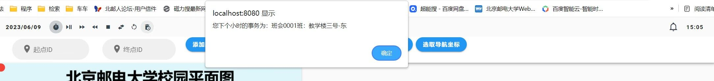
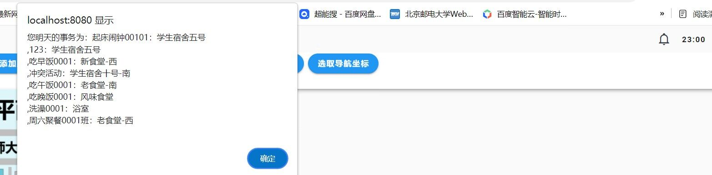

    <h2>2023春 数据结构课程设计</h2>
    <h2>21组</h2>
	<h1>测试报告</h1>

| 组号 |    班级    |  姓名  |    学号    |
| :--: | :--------: | :----: | :--------: |
|  21  | 2021211308 | 郭泽远 | 2021211183 |
|  21  | 2021211308 | 郭晨旭 | 2021211184 |
|  21  | 2021211308 | 叶沛鑫 | 2021211174 |

    <h2>目录</h2>

[toc]

# 测试报告

## 运行效果测试

### 日程及用户管理测试

展示用户的所有课程(能通过课程表展示课程的详细信息)

展示用户的所有集体活动和个人日程(包括个人活动、临时事务和闹钟)

根据日程的名称进行查询

根据活动/临时事务类型和日期进行查询

添加活动冲突并返回三个可用时间段

###模拟时间的效果

提醒下一个小时日程

提醒第二天的日程

## 具体接口测试

### 地图编辑器

加入点

加入边

获取所有非道路的建筑物节点

删除整个地图

### 导航

点到点导航

途径多点导航

### 用户模拟时间

webSocket接口

开始模拟

终止模拟

暂停模拟

继续模拟

加快模拟速度

降低模拟速度

重置用户的模拟到指定时间

翻转用户模拟时间方向

